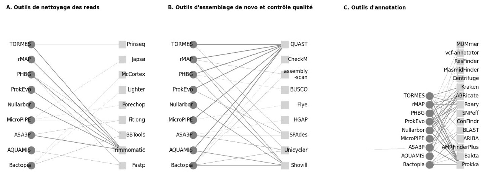
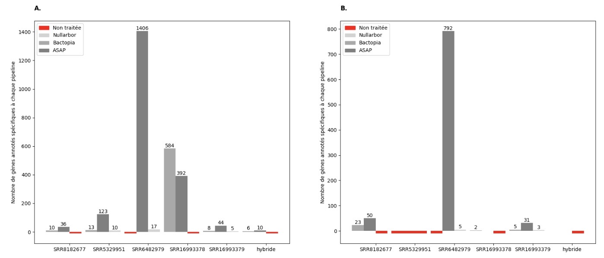
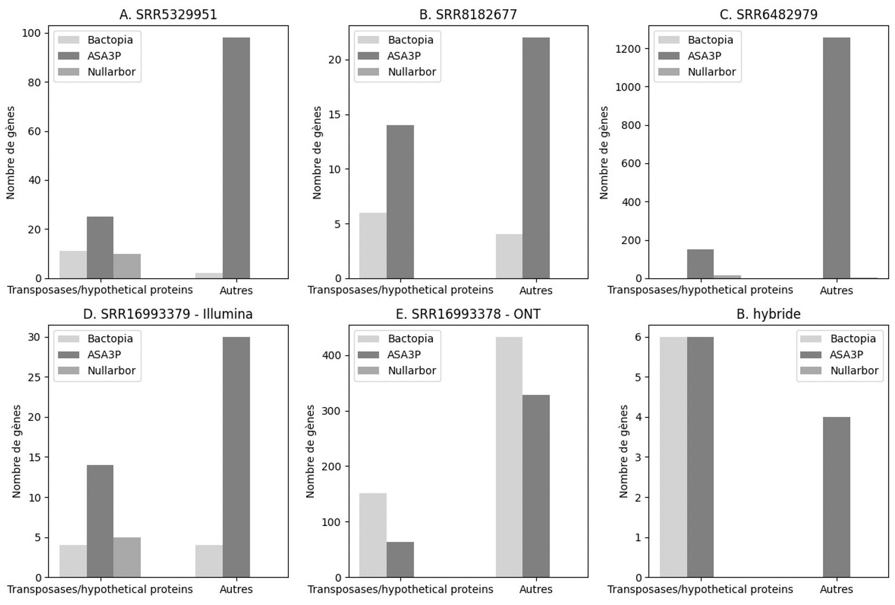
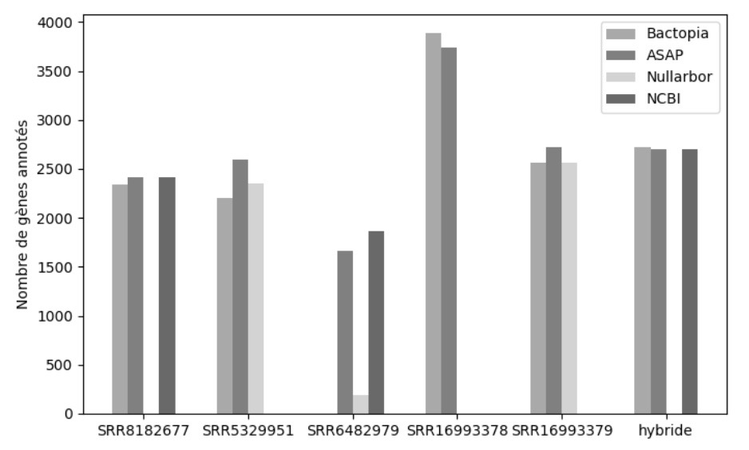
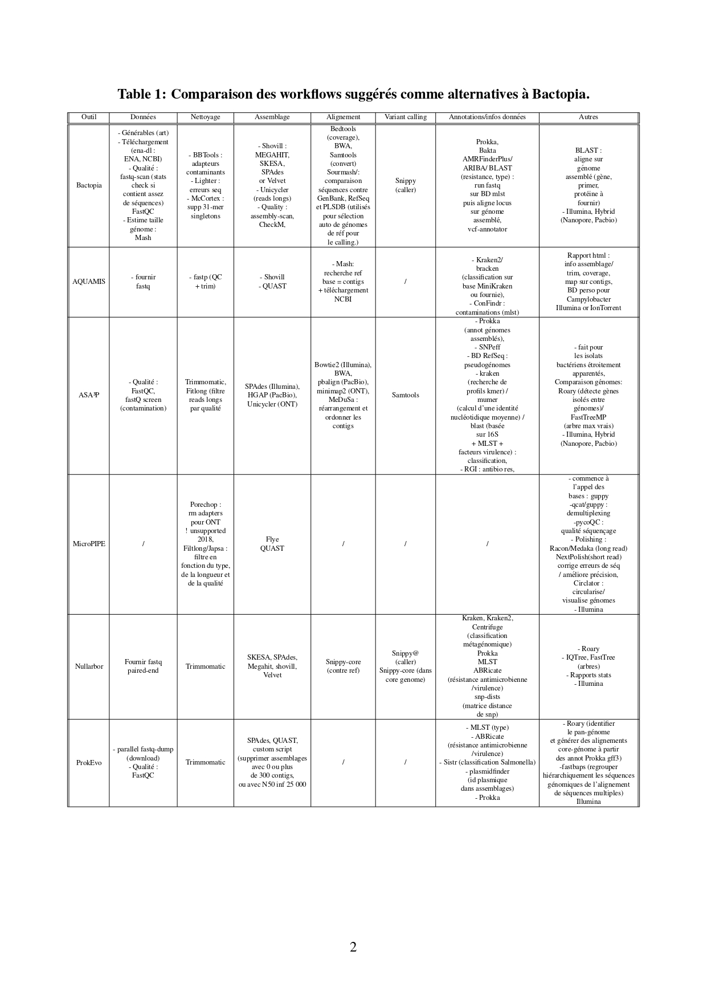
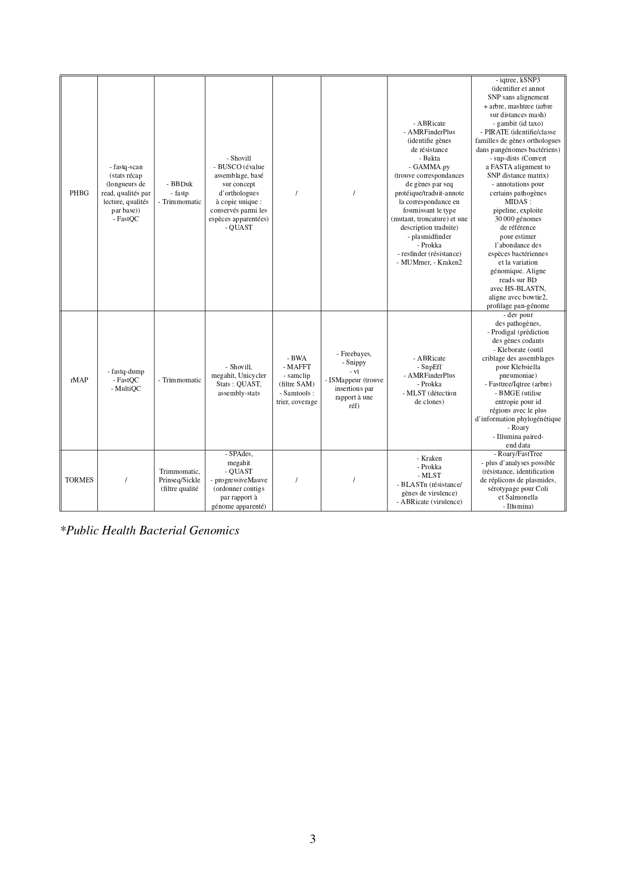
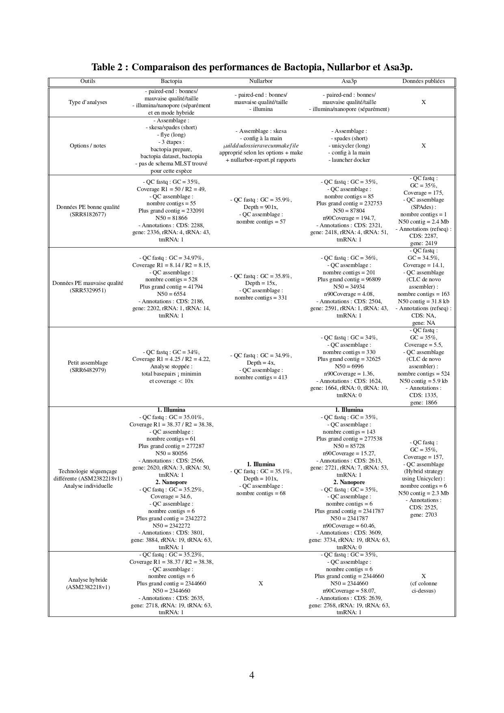

# Analyse comparative de trois pipelines d'analyse de données NGS : Bactopia, ASA3P et Nullarbor

__Fiona Hak1,2, supervisé par Valentin Loux1 et Sophie Schbath1__
 
1. INRAE Jouy-en-Josas - Antony 2. Université Paris-Saclay

Ce dépôt contient les éléments de méthode détaillés du travail que j'ai réalisé pendant les mois de mai et juin mon stage de Master 1, tels que les commandes, les scripts et les figures. Il sert de complément détaillé au rapport qui se trouve dans le dossier "report".

# Table des matières

- [Introduction](#introduction)
- [Jeu de données](#jeu-de-données)
- [Installation des outils](#installation)
  - [Bactopia](#bactopia)
  - [Nullarbor](#nullarbor)
  - [ASA3P](#asap)
- [Méthodes](#methodes)
  - [Lancement des analyses](#lancement)
  - [Traitement des sorties](#traitement)
  - [Comparaison des performances de GDFF-annot à celles de Bactopia, ASA3P et Nullarbor](#comp)
- [Figures](#figures)
- [Références](#ref)
- [License](#license)

## Introduction

Nous avons fait une évaluation comparative de trois pipelines d'analyse de données brutes de séquençage NGS : Bactopia, ASA3P et Nullarbor. L'objectif de cette évaluation est de déterminer si l'un de ces pipelines répond aux besoins d'analyse du projet "Défis des Ferments du Futur" mené à l'INRAE en 2023. Dans le cas où aucun des pipelines ne serait compatible, l'objectif est d'identifier les outils pertinents pour développer notre propre pipeline.

## Jeu de données

Les comparaisons ont été faites sur un jeu de données hétérogène en qualité.
L'espèce choisie est <i>Lactoccocus lactis</i>, une bactérie utilisée en fromagerie pour la capacité de certaines de ses souches à métaboliser métaboliser le citrate et de le convertir en diacétyle, ce qui donne un arome de beurre.

| N° d'accession (fastq) |    Séquenceur    | Lien vers l'assemblage publié |
|:-----------------------|:----------------:|:-----------------------------:|
| SRR5329951               |     Illumina     |           https://www.ncbi.nlm.nih.gov/datasets/genome/GCA_002322075.1/            |
| SRR8182677          |     Illumina     |           https://www.ncbi.nlm.nih.gov/datasets/genome/GCF_003722275.1/            |
| SRR6482979               |     Illumina     |           https://www.ncbi.nlm.nih.gov/datasets/genome/GCA_003446595.1/            |
| SRR16993378    | Oxford Nanopore  |           https://www.ncbi.nlm.nih.gov/datasets/genome/GCF_023822185.1/            |
| SRR16993379    |     Illumina     |           https://www.ncbi.nlm.nih.gov/datasets/genome/GCF_023822185.1/            |

Une référence est utilisée par ASA3P et Nullarbor pour les étapes d'alignement, puis dans l'analyse comparative des fichiers d'annotation des différents génomes avec Quast. Nous avons utilisé la souche LAC460 (https://www.ncbi.nlm.nih.gov/nuccore/NZ_CP059048.1/).

Les lectures ont été téléchargées directement sur le serveur avec wget. Elles peuvent être récupérées en allant sur la page du BioSample de chaque assemblage, puis en cliquant sur l'onglet "SRA."

## Installation des outils
### Bactopia

Sur le serveur front de Migale, j'ai installé Bactopia dans mon espace home personnel. Cependant, il n'a pas été possible de l'installer de manière partagée pour tous les utilisateurs du serveur, car son exécution nécessite des autorisations d'écriture dans des répertoires inaccessibles sans les privilèges root. J'ai suivi la documentation [1] pour effectuer l'installation de l'outil en utilisant les packages mamba et conda :

    mamba create -y -n bactopia -c conda-forge -c bioconda bactopia
    conda activate bactopia

Par la suite, il a fallut les privilèges root pour construire les dépendances avec conda dans mon environnement.
Les installations avec conda ont été un échec, certai s packages s'affichant comme étant incompatible.

### Nullarbor

Dans un premier temps, Nullarbor a été installé sur le serveur. Cependant, il y a une incompatibilité entre les versions de bcftools et de samtools, ce qui empêche le déroulement des étapes nécessitant ces outils. Étant donné qu'aucune solution n'a été trouvée pour l'installation partagée sur le serveur, j'ai décidé de lancer les analyses localement en utilisant Docker. Le fichier Docker correspondant se trouve dans le dossier "dockerfiles". Il fait référence à une image précédente du pipeline qui est distribuée sur le hub, plutôt qu'à la version actuellement disponible sur le dépôt GitHub du pipeline [2] (la dernière version fonctionnelle d'après mes tests). Un dossier contenant les données et un fichier de configuration (data/nullarbor_config.tsv) y est copié et un entrypoint comportant les commandes de lancement du pipeline y est configuré.
Pour builder l'image, la commande est :

    docker build --no-cache --platform=linux/amd64 -f dockerfiles/nullarbor.Dockerfile -t nullarbor .
    docker run --volume $PWD/nullarbor:/app nullarbor

Le container est lancé en configurant un volume pour récupérer les fichiers en local.

### ASA3P

En raison des problèmes de sécurité liés aux droits root dans les images Docker sur un serveur partagé, il n'a pas été possible d'installer ASA3P, qui est spécifiquement conçu pour être utilisé avec Docker. Par conséquent, j'ai lancé ASA3P localement en suivant les instructions disponibles sur le dépôt GitHub officiel [3].
Pour commencer, j'ai récupéré l'image officielle mise à disposition par le développeur, puis j'ai téléchargé et décompressé les exécutables du pipeline :

    sudo docker pull oschwengers/asap
    wget https://zenodo.org/record/3780003/files/asap.tar.gz
    tar -xzf asap.tar.gz
    rm asap.tar.gz

Dans un deuxième temps j'ai lancé l'executable sur un dossier contenant les données et un fichier de configuration (data/asa3p_config.xls).

## Méthodes
### Lancement des analyses

<b>1. [Bactopia](https://github.com/bactopia/bactopia)</b>

J'ai soumis l'ensemble complet des données à Bactopia sur le cluster de calcul en utilisant l'environnement conda "bactopia" installé exclusivement dans mon espace (/home/fhak).  Dans un premier temps, j'ai souhaité que l'étape d'annotation se fasse avec [Prokka](https://github.com/tseemann/prokka), qui est l'outil par défaut. La commande complète qui a été utilisée est :

    qsub -cwd -V -q short.q -N bactopia_lactis -pe thread 4 -b y "conda activate bactopia && bactopia --samples samples.txt --datasets datasets/ --species 'Lactococcus lactis' --run_checkm --max_time 860 --min_time 120 -resume && conda deactivate"

Pour générer le dossier "datasets", qui contient un ensemble de données ciblées et formatées pour des analyses ultérieures, nous avons rassemblé des informations provenant de diverses banques de données telles que RefSeq, Genbank, Ariba getref et PubMLST, en nous basant sur l'espèce spécifique fournie, à savoir <i>Lactococcus lactis</i>. La commande utilisée pour générer ce dossier est la suivante :
    
    bactopia datasets --species "Lactococcus lactis" --include_genus --skip_amr

La partie concernant la résistance antimicrobienne a été exclue de la construction du dossier car il semble que l'espèce <i>Lactococcus lactis</i> ne soit pas disponible pour cette analyse. Cela a entraîné une erreur qui a entrainé l'échec de l'étape, et il ne semble pas possible de résoudre ce problème sans modifier le code.
Le fichier sample.txt est le fichier de configuration qui a été généré avec bactopia prepare :

    bactopia prepare data/ --ont > samples.txt

Ou data est le dossier qui contient les fasta et "--ont" spécifie que tout fastq single-end doit être traité comme des données issues d'un séquençage Oxford Nanopore. 
Dans un deuxième temps, les analyses ont été répétées sur les mêmes données et configurations en utilisant [Bakta](https://github.com/oschwengers/bakta) comme outil d'annotation :

    qsub -cwd -V -q short.q -N bactopia_lactis_bakta -pe thread 4 -b y "conda activate bactopia && bactopia --samples samples.txt --datasets datasets_ref/ --species 'Lactococcus lactis' --run_checkm --use_bakta --bakta_db /db/outils/bakta-1.5.0/db/ --max_time 860 --min_time 120 && conda deactivate"

Une base de données compatible de Bakta avait déjà été téléchargée sur le serveur et est accessible à tous les utilisateurs. Elle est disponible dans le dossier "/db/outils/bakta-1.5.0". La version de [Bakta](https://github.com/oschwengers/bakta) utilisée par Bactopia est la 1.5.1. 
Le format du fasta protéique de référence pour l'espèce téléchargé lors de la construction du dataset n'est pas compatible avec l'utilisation de Bakta. Le reformatage n'étant pas inclu dans le pipeline, j'ai développé un script bash permettant de convertir les headers du fasta au format supporté par Bakta ([scripts/reformat_fasta.sh](scripts/reformat_fasta.sh)). Il permet de remplacer les informations manquantes par la mention "unknown" et d'ajouter un code InterPro si il n'existe pas. 

Dans les deux cas, une analyse avec [CheckM](https://github.com/Ecogenomics/CheckM) est effectuée en utilisant l'option (--run_checkm). Cependant, lors de l'assemblage en mode hybride avec (https://github.com/rrwick/Unicycler), le temps maximal alloué par Nextflow pour chaque tâche est dépassé, ce qui entraîne une erreur. Pour résoudre ce problème, le temps maximum a été augmenté à 860 minutes.

<b>2. [Nullarbor](https://github.com/tseemann/nullarbor)</b>  
Dans un premier temps, Nullarbor a été lancé sur le serveur avec les commandes :

    qsub -cwd -V -q short.q -N nullarbor -pe thread 4 -b y "conda activate nullarbor-2.0.20191013 && nullarbor.pl --name lactis --ref data/LAC460_ref.fasta --input input_file.tsv --outdir results --trim && cd nullarbor/results && make -j 4 && conda deactivate

Un dossier results contenant un Makefile et les dossiers de résultats vides est d'abord créé avec nullarbor.pl, puis le Makefile est lancé pour effectuer les analyses.
Dans ce cas les versions de samtools et bcftools installés avec conda ne sont pas compatibles et les étapes d'alignement et de variant calling sont ignorées. 
L'[entrypoint](dockerfiles/entrypoint.sh) configuré pour le lancement en docker reprend exactement les mêmes paramètres :

    nullarbor.pl --name lactis --ref /app/data/LAC460_ref.fasta --input /app/input_file.tsv --outdir /app/results --trim
    cd /app/results && make -j 4

Cependant, l'image docker utilisée pour lancer les analyses est une version antérieure à celle partiellement installée sur le serveur. Pour une raison inconnue, certaines étapes du processus sont aléatoirement ignorées pour certaines données du dossier. Lors de l'analyse du génome SRR8182677, l'exécution s'arrête après l'étape de nettoyage des données, sans aucune erreur signalée. De plus, certaines annotations ne sont jamais réalisées. Étant donné que des étapes sont manquantes dans les deux cas, il n'a pas été possible de lancer le script nullarbor-report.pl sur le dossier "results". Ce script est responsable de la génération des rapports, qui sont l'aspect principal et caractéristique de Nullarbor.

<b>3. [ASA3P](https://github.com/oschwengers/asap)</b>  
ASA3P est lancé via l'exécutable qui lance docker :

    asap/asap-docker.sh -p launch_asap -d

launch_asap est un dossier contenant un sous-dossier avec les données et le fichier de configuration. L'option -d permet d'écrire des logs plus détaillés.
Les options sont limitées à la spécification des chemins vers les exécutables, les données et de passer des étapes. Il n'est pas possible de passer des options aux différents outils dans le pipeline.
  

Certains génomes n'ont pas été analysées, ou analysées partiellement par un ou plusieurs pipelines pour des causes varibles :

| N° d'accession (fastq) |    Analysées par (...)     |                        Raison d'une absence d'analyse                         |
|:-----------------------|:--------------------------:|:-----------------------------------------------------------------------------:|
| SRR5329951               | Bactopia, ASA3P, Nullarbor |                                       X                                       |
| SRR8182677          |      ASA3P, Bactopia       |     Nullarbor : arrêt de l'analyse avec l'étape de nettoyage sans erreur      |
| SRR6482979               |         ASA3P, Nullarbor                   | Bactopia : couverture/qualité insuffisante : ne passe pas le contrôle qualité |
| SRR16993378    |             Bactopia, ASA3P               |          Nullarbor : ne traite pas les reads long ni le mode hybride          |
| SRR16993379    |             Bactopia, ASA3P, Nullarbor               |                 Nullarbor : analyse uniquement en individuel                  |

### Traitement des sorties

<b>1. Evaluation de l'assemblage</b>

L'évaluation s'est basée sur deux métriques principales : le nombre de contigs et le N50.
Les comparaisons ont été faites entre les annotations des mêmes génomes avec les trois pipelines et entre les annotations Prokka et Bakta faites pour chaque génome par Bactopia.
Pour Bactopia, ces métriques ont été relevées dans les fichiers report.txt du rapport Quast de l'assemblage.
Pour ASA3P, ils ont été relevées dans les fichiers info.json du dossier des assemblages.
Enfin, Nullarbor ne relève aucune métrique lui même. Pour pouvoir comparer ses performances d'assemblage avec les autres pipelines, les fichiers d'assemblage ont été soumis à Quast :

    quast contig.fa

Ou contig.fa est le fichier de contigs dans chaque dossier de résultat pour chaque génome.
Les métriques ont été relevées dans les fichiers report.txt générés.

<b>2. Evaluation de l'annotation</b> 

Pour évaluer l'annotation deux méthodes ont été utilisées. Tout d'abord avec [Quast](https://github.com/ablab/quast), les fichiers d'annotation au format GFF contenant les contigs ont été réalignés et les gènes ont été recherchés sur la référence. En parallèle, [Roary](https://github.com/sanger-pathogens/Roary) a été utilisé pour déterminer le pan-génome entre les mêmes souches traitées par les différents pipelines.

<b>2.1. Avec Quast</b> 

Les fichiers GFF avec les contigs ont été soumis contre les contigs et les annotations de référence publiés sur le NCBI (téléchargés depuis les liens des assemblages disponibles dans la section jeu de données) à une analyse avec Quast selon les paramètres :

    quast -r reference_contig_ncbi.fna -o results --features gene:reference_annotation_ncbi.gff fichier_annotation_1.gff fichier_annotation_2.gff

Les sorties ont permit une analyse syntaxique annotations. Pour celà, j'ai automatisé le traitement des fichiers résultats produits "prefix-gff_genomic_features_gene.txt". Ils ont été traités avec le script [process_quast_file.py](scripts/process_quast_file.py). Il permet de comparer deux ou trois fichiers entre eux et d'en tirer le nombre de gène commun ou spécifique à chaque pipeline, leur position dans le contig et de savoir si ils ont été retrouvés partiellement ou complètement sur la référence.
Il peut y avoir 2 ou 3 sorties à comparer car certains génomes ne sont pas traités par un pipeline à cause de problèmes techniques ou des arrêts d'analyse par manque de qualité (voir section Lancement des analyses).

<b>2.2. Avec Roary</b> 

Les sorties ont permit une analyse syntaxique et fonctionnelle annotations. La commande est :

    roary -e -mafft -p 6 -o folder_name *.gff
 
Mafft est utilisé pour l'alignement des contigs. Le fichier de sortie produit qui nous intéresse est le gene_presence_absence.csv. 
Les sorties ont été traitées avec le script [process_roary_file.py](scripts/process_roary_file.py). Il permet de comparer deux ou trois fichiers de sortie entre eux et de relever les catégories fonctionnelles des gènes trouvés spécifiquements par un des pipelines.

<b>3. Vérification des annotations communes</b>

Les annotations étiquettées comme communes à tous les pipelines ont été vérifiées pour s'assurer que les produits correspondent réellement et ne sont pas issus d'un consensus.
Le script [is_annot_similar.py](scripts/is_annot_similar.py) permet de rassembler les produits relevés pour chaque annotation commune dans trois listes distinctes. Ces listes sont comparées pour en extraire le nombre de correspondances exactes, le nombre de correspondance par mots clefs et le nombre total d'annotations communes.

### Comparaison des performances de GDFF-annot à celles de Bactopia, ASA3P et Nullarbor

Les sorties d'annotation GFF ont été traités avec Roary :

    roary -e -mafft -p 6 -o folder_name *.gff

Les sorties ont été traitées avec [process_roary_file.py](scripts/process_roary_file.py) : une fonction a été ajoutée pour comparer quatre fichiers entre eux de manière analogue à ce qui a été décrit en section 2.2.

## Figures

<b>Figure 1 : Etat de l'art des outils les plus fréquemment utilisés par les pipelines mentionnés par Bactopia ([graph_reseau.py](results/graph_reseau.py)).</b> 

<b>Figure 2 : Nombre d'annotation spécifique qu'effectuent les trois pipelines pour l'analyse de chaque souche. A. Avec Roary. B. Avec Quast contre la référence Lactis. NB : la barre est en rouge lorsque la souche n'est pas analysée par le pipeline ([graph_multi_hist.py](results/graph_multi_hist.py)).</b> 

<b>Figure 3 : Catégories fonctionnelles des annotations spécifiques relevés par Roary qu'effectuent les trois pipelines pour l'analyse de chaque souche ([graph_multi_functionnal_categories.py](graph_multi_functionnal_categories.py)).</b> 

<b>Figure 4 : Nombre de gènes annotés pour chaque souche traitée par les trois pipelines.</b> 

 

 

 

## Références

[1] Read TD. Github repository of bactopia, 2020 (https://github.com/bactopia/bactopia). 
[2] Torsten Seemann et al. Github repository of Nullabor, 2012 (https://github.com/tseemann/nullarbor). 
[3] Oliver Schwengers et al. Github repository of asa³p - automatic bacterial isolate assembly, annotation and analyses
pipeline, 2020 (https://github.com/oschwengers/asap). 

## License
APache 2.0

